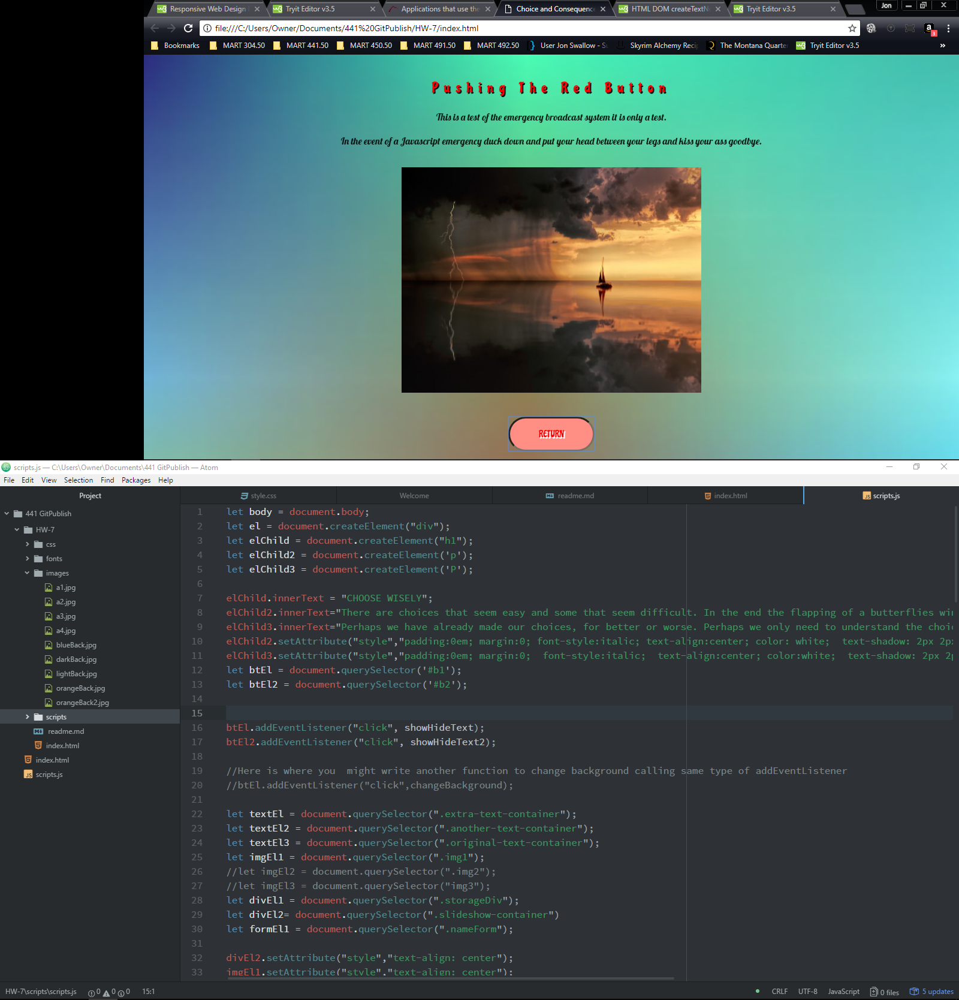
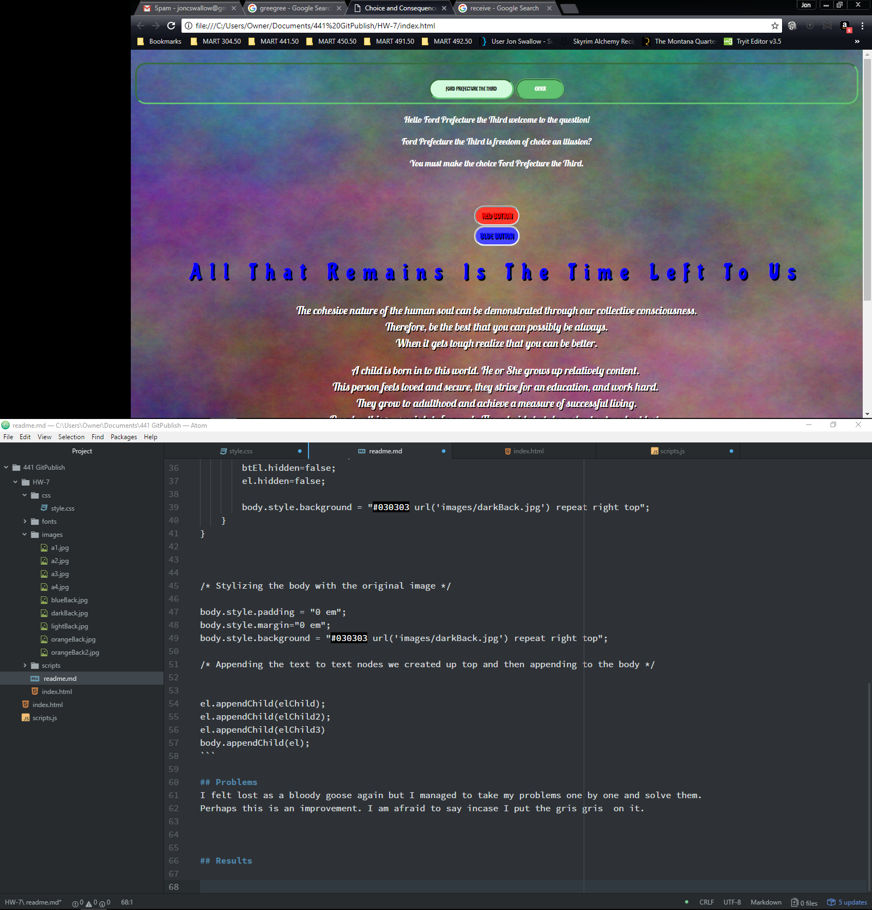

# Homework 7

[Live Site](https://jonswallow.github.io/HW-7)

[Repository](https://github.com/JonSwallow/HW-7)

## Overview

This one was not nearly as bad as it was not as restricting.
Having three different methods of solving problems was better than one.

## Code
```
function showHideText2() {
    if(textEl2.hidden){
        btEl2.innerText = "Return";
        textEl2.hidden = false;
        imgEl1.hidden=false;
        formEl1.hidden= true;
        divEl1.hidden=true;
        textEl3.hidden=true;
        textEl.hidden=true;
        btEl.hidden=true;
        el.hidden=true;

        body.style.background = "#030303 url('images/orangeBack.jpg') repeat right top";
        setTimeout(()=>{body.style.background = "#030303 url('images/orangeBack2.jpg') repeat right top" ;}, 3000 );

    } else {
        btEl2.innerText = "Blue Button";
        textEl2.hidden = true;
        imgEl1.hidden=true;
        formEl1.hidden=false;
        divEl1.hidden= false;
        textEl3.hidden=false;
        btEl.hidden=false;
        el.hidden=false;

        body.style.background = "#030303 url('images/darkBack.jpg') repeat right top";
    }
}


/* Stylizing the body with the original image */

body.style.padding = "0 em";
body.style.margin="0 em";
body.style.background = "#030303 url('images/darkBack.jpg') repeat right top";

/* Appending the text to text nodes we created up top and then appending to the body */


el.appendChild(elChild);
el.appendChild(elChild2);
el.appendChild(elChild3)
body.appendChild(el);
```

## Problems
I felt lost as a bloody goose again but I managed to take my problems one by one and solve them.
Perhaps this is an improvement. I am afraid to say incase I put the gris gris  on it.


## Results




### Future work
Still leary of it but willing to try.

### Comunity Spirit
Chelsea has the Discord room so it is in good hands. I still pop in and try and help.
I haven't seen anything on the forum for a long time.

### Conclusions

I can't believe I did it and kept my composure. Wow.
